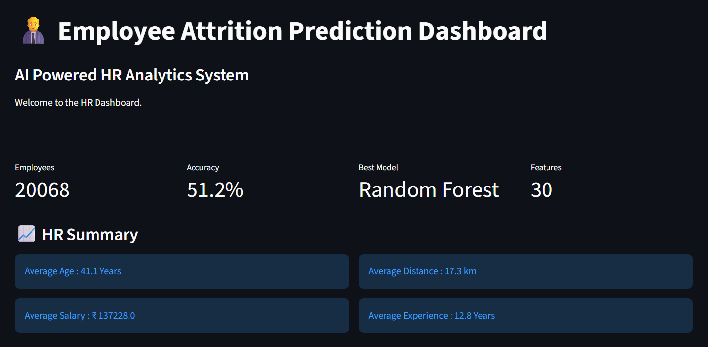
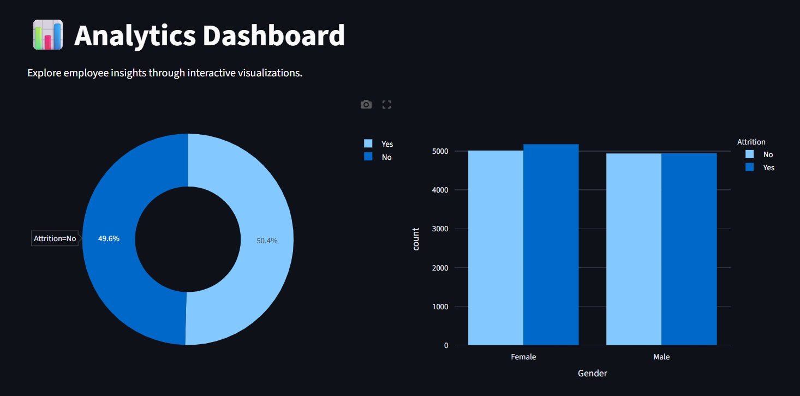
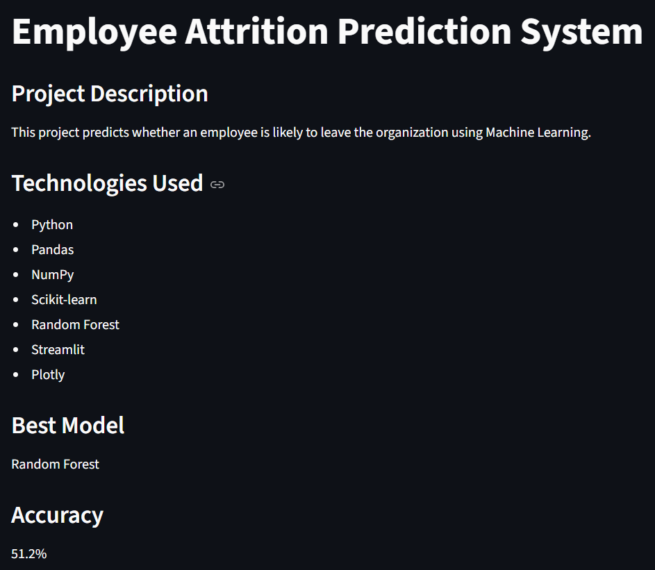
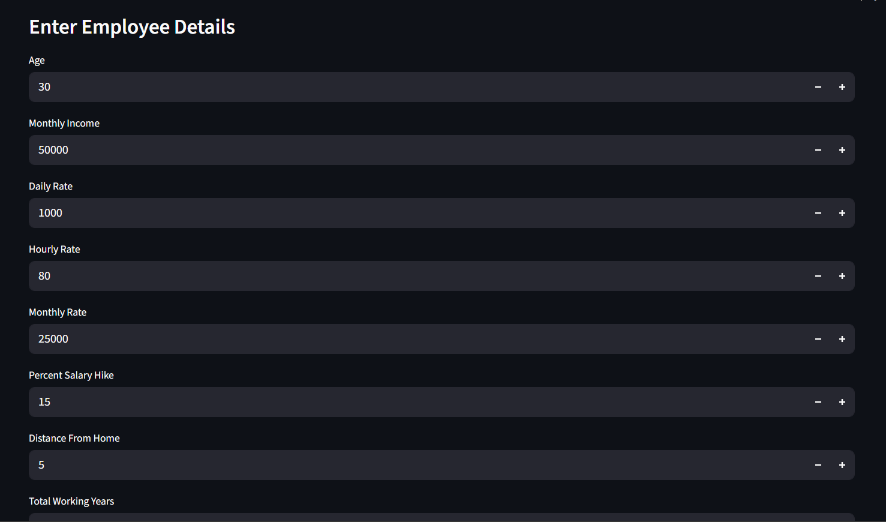
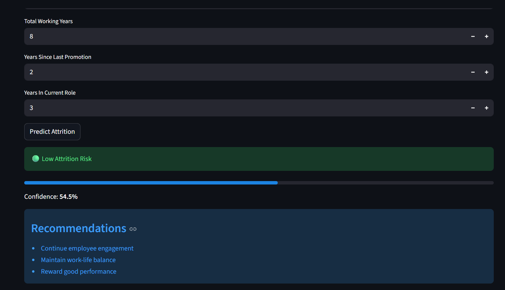

# 👨‍💼 Employee Attrition Prediction System

A Machine Learning based Employee Attrition Prediction System developed using Python, Scikit-learn and Streamlit.

---

# 📌 Project Overview

Employee attrition is one of the biggest challenges faced by organizations. This project predicts whether an employee is likely to leave the company based on HR-related attributes using Machine Learning.

The application provides:

- Employee Attrition Prediction
- Interactive Dashboard
- HR Analytics
- Model Performance Analysis
- Recommendations based on prediction

---

# 🚀 Features

✔ Employee Attrition Prediction

✔ Interactive Streamlit Dashboard

✔ HR Analytics Visualization

✔ Machine Learning Prediction

✔ Employee Recommendation System

✔ Confidence Score

---

# 🛠 Technologies Used

- Python
- Pandas
- NumPy
- Scikit-learn
- Streamlit
- Plotly
- Joblib

---

# 🤖 Machine Learning Model

Model Used:

**Random Forest Classifier**

Model Accuracy:

**51.2%**

---

# 📊 Dashboard

## Home Page



---

## Analytics Dashboard



---

## About Project



---

## Prediction Page



---

## Prediction Result



---

# 📂 Project Structure

```
Employee_Attrition_Project
│
├── dataset
├── notebooks
├── pages
├── screenshots
├── app.py
├── README.md
└── requirements.txt
```

---

# ▶️ Run the Project

Clone the repository

```bash
git clone https://github.com/Dhanushree-12/employee-attrition-prediction.git
```

Install dependencies

```bash
pip install -r requirements.txt
```

Run Streamlit

```bash
streamlit run app.py
```

---

# 📈 Future Enhancements

- Improve prediction accuracy
- Deploy on Streamlit Cloud
- Add Explainable AI (SHAP)
- Real-time HR database integration

---

# 👩‍💻 Author

**Dhanushree**

MCA Graduate

Machine Learning | Python | Data Analytics